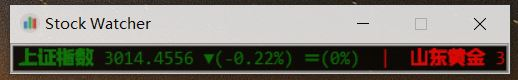

StockWatcher
=====

Desktop tool for stock price monitoring and alarm, using floating window, marquee effect display.股票价格监控与报警的桌面工具，采用浮动窗口，跑马灯效果显示..

## 功能介绍:
* 
* 桌面浮动窗，跑马灯风格显示股票价格
* 鼠标悬停，文字停止滚动
* 鼠标左击，显示分时图
* 可配置多支股票，每支股票可配置:成本价，止盈位，止损位

## 文件说明:
* stockwatcher.py 程序文件
* stockwatcher.conf 配置文件
* /bin 在windows下编译的完整程序，可直接运行 

## Supported platforms
* Linux
* MacOS
* windows

## License
	Copyright (C) 2017 Wesley Wu jie1975.wu@gmail.com
	This code is licensed under The General Public License version 3
	
## FeedBack
	Your feedbacks are highly appreciated! :)
